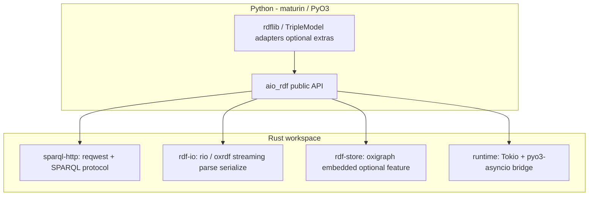

# Plan: Fully Async, Rust-Backed RDF for Python

**Status:** Proposal (not started)  
**Working name:** `aio-rdf` (PyPI name TBD — verify availability)  
**Audience:** SparqlModel maintainers, potential library authors, FastAPI / asyncio app developers  

Related: [ROADMAP.md](ROADMAP.md) (SparqlModel **0.4** async session) · [ECOSYSTEM.md](ECOSYSTEM.md) · [PLAN.md](PLAN.md) · [Pyoxigraph](https://pyoxigraph.readthedocs.io/)

---

## Executive summary

Build a **Python package whose public API is async-first**, with a **Rust core** for I/O, parsing, and optional embedded triple storage. The package does **not** replace rdflib or Pyoxigraph wholesale; it owns **non-blocking RDF operations** that today’s stack lacks:

1. **Async SPARQL protocol** — query/update over HTTP(S) without blocking the event loop.  
2. **Streaming parse/serialize** — large files and response bodies without loading everything into Python first.  
3. **Optional embedded store** — Oxigraph (or similar) behind `async` methods, with heavy work off the loop via a dedicated runtime or thread pool.  

**SparqlModel** remains the ORM (sessions, cascade, query DSL). **TripleModel** remains the Pydantic ↔ RDF mapping engine. **`aio-rdf`** is infrastructure: async store + HTTP + fast parse, consumable by SparqlModel’s `AsyncStore` and by apps that do not need an ORM.

---

## Problem

| Pain today | Who feels it |
|------------|----------------|
| rdflib is **sync**; no async graph or HTTP | FastAPI apps, agents, concurrent ETL |
| SparqlModel `HttpStore` uses **sync `httpx.Client`** | Same — blocks the event loop on every remote call |
| Pyoxigraph is **fast but sync**; **no remote endpoint client** | Apps that want Rust speed *and* async HTTP |
| “Use `asyncio.to_thread()`” works but is **ad hoc** — no standard types, streaming, or cancellation | Every project reinvents wrappers |
| Full “async rdflib” fork is **too large** to maintain | Ecosystem |

**Goal:** One small, opinionated library that makes **async RDF I/O** as boring as `httpx` + `asyncpg` — not a second rdflib.

---

## Vision

**`aio-rdf` — async RDF I/O and storage for Python, Rust where it matters.**

```text
Application  (FastAPI, agents, ETL)
      ↓
SparqlModel AsyncSPARQLSession  (optional ORM)
      ↓
aio-rdf  (async Store, SparqlClient, stream parse)
      ↓
Rust: reqwest/httpx bridge · rio/oxrdf parse · oxigraph store (optional)
      ↓
Remote SPARQL endpoint · files · in-memory/disk dataset
```

**Metaphor:** `asyncpg` / `httpx` for RDF — not SQLAlchemy, not rdflib.

---

## Positioning

| Package | Role | Async? | Rust? | Remote SPARQL HTTP? |
|---------|------|--------|-------|---------------------|
| **rdflib** | General RDF in Python | No | No | Via plugins / manual |
| **Pyoxigraph** | Embedded SPARQL store + parse | No | Yes | No (local store only) |
| **SparqlModel** | ORM + compiler + stores | **0.4** (Python async on sync rdflib mirror) | No (today) | Via `HttpStore` / `AsyncHttpStore` |
| **TripleModel** | Pydantic mapping | No | No | No |
| **`aio-rdf` (proposed)** | Async I/O + optional fast store | **Yes (primary)** | Yes | **Yes (core)** |

### What we do not compete with

- **ORM semantics** — cascade, identity map, query DSL → SparqlModel.  
- **Pydantic model mapping** → TripleModel.  
- **General-purpose sync graph API** → rdflib (interop, not replacement).  
- **Reimplementing all of Pyoxigraph’s Python API** → integrate or delegate.

### Relationship to SparqlModel **0.4**

SparqlModel **0.4** can ship **`AsyncHttpStore`** built on **`httpx.AsyncClient`** alone. That is sufficient for ORM async end-to-end.

**`aio-rdf`** becomes attractive when you want:

- Shared, tested SPARQL protocol client (retries, auth, read/write URLs, streaming JSON bindings).  
- Rust-accelerated parse/serialize with **async iteration** of triples.  
- Embedded **Oxigraph** store with a **documented** async execution model (not ad hoc `to_thread` per caller).  
- One dependency for “async RDF plumbing” used by SparqlModel, TripleModel tools, and non-ORM apps.

**Integration target:** SparqlModel `AsyncStore` protocol implemented by `aio_rdf.SparqlEndpointStore` and `aio_rdf.OxigraphStore`.

---

## Design principles

1. **Async-first public API** — sync helpers may exist as thin `asyncio.run()` wrappers for scripts, but design and docs lead with `async def`.  
2. **Rust for hot paths** — HTTP, parsing, bulk load, SPARQL evaluation in embedded store; Python for ergonomics and integration.  
3. **Interop over reinvention** — convert to/from `rdflib.Graph` / `rdflib.term` when needed; do not require apps to abandon rdflib.  
4. **Explicit event-loop contract** — document what runs on the loop vs thread pool vs Tokio (see [Execution model](#execution-model)).  
5. **Small surface, stable protocol** — few types: `Term`, `Quad`, `BindingSet`, `SparqlClient`, `AsyncStore`.  
6. **No ORM in core** — keep the crate/package free of Pydantic and session lifecycle.

---

## Architecture

### Layered stack



### Rust workspace (proposed crates)

| Crate | Responsibility |
|-------|----------------|
| `aio-rdf-types` | `Term`, `Quad`, `Literal`, errors; shared with Python via PyO3 |
| `aio-rdf-http` | SPARQL 1.1 Query/Update over HTTP; streaming result parsers (JSON, CSV, TSV) |
| `aio-rdf-io` | Async/read streaming parse; serialize sinks; formats: N-Triples, N-Quads, Turtle, TriG (phased) |
| `aio-rdf-store` | Optional Oxigraph wrapper: `query`, `update`, `add`/`remove` quads |
| `aio-rdf-py` | PyO3 module: exposes asyncio-compatible objects |

### Python package layout

```text
aio_rdf/
  __init__.py          # SparqlClient, OxigraphStore, open_store, ...
  client.py            # thin wrappers if needed
  store.py
  terms.py             # Python Term types or re-export from extension
  _native.abi3.so      # maturin-built extension
  integrations/
    rdflib.py          # optional extra aio-rdf[rdflib]
```

---

## Execution model

Rust speed ≠ asyncio-friendly. The plan **defines** where each kind of work runs.

| Operation | Recommended runtime | Rationale |
|-----------|-------------------|-----------|
| HTTP SPARQL request/response | **Tokio** (native async) via `reqwest` + `pyo3-asyncio` | True non-blocking I/O |
| Streaming read from socket/file | **Tokio** | Same |
| Small in-memory store op | **Tokio task** or **inline** if &lt;1ms | Avoid thread churn |
| Large parse / bulk load / heavy SPARQL | **Tokio blocking pool** or **`spawn_blocking`** | CPU-bound; release GIL, don’t block loop |
| Embedded Oxigraph `query()` | **`spawn_blocking`** initially; optimize later | Pyoxigraph today is sync; match until native bridge exists |

**Public rule for users:** `await` always yields control; CPU-heavy work is documented per method.

**Phase 1 acceptable shortcut:** HTTP truly async; embedded store methods use `asyncio.to_thread()` inside Rust extension or Python wrapper — still valuable if HTTP is the bottleneck (typical for SparqlModel + Fuseki).

**Phase 2:** `pyo3-asyncio` + shared Tokio runtime for HTTP + store on one runtime.

---

## Public API (sketch)

### 1. `SparqlClient` — remote endpoint

```python
async with SparqlClient("https://example.org/sparql") as client:
    rows = await client.select("SELECT ?s WHERE { ?s ?p ?o }", prefixes={"ex": "..."})
    async for row in client.select_iter(...):  # streaming
        ...
    await client.update("INSERT DATA { ... }")
```

Features: auth (basic, bearer), timeouts, retries, separate `query_url` / `update_url`, `User-Agent`, cancellation.

### 2. `AsyncStore` protocol (align with SparqlModel)

```python
class AsyncStore(Protocol):
    async def query(self, sparql: str) -> list[dict[str, Any]]: ...
    async def update(self, sparql: str) -> None: ...  # or update_graph(add, remove)
    async def close(self) -> None: ...
```

Implementations:

- **`SparqlEndpointStore`** — mirror + remote (same semantics as SparqlModel `HttpStore` mirror contract).  
- **`OxigraphStore`** — local embedded; optional persistence path.  
- **`MemoryStore`** — pure Rust in-memory for tests (optional).

### 3. Streaming parse / serialize

```python
async for quad in parse_path_async("huge.nt", format="nt"):
    await store.insert_quad(quad)

async for chunk in serialize_async(store, format="ntriples"):
    ...
```

Returns **`aio_rdf.Quad`** or converter to rdflib.

### 4. Term interchange

- Native: `aio_rdf.NamedNode`, `Literal`, `BlankNode`, `Quad`.  
- `to_rdflib(quad)`, `from_rdflib(triple)` in `aio-rdf[rdflib]` extra.

---

## SparqlModel integration

| SparqlModel piece | Today | With `aio-rdf` |
|-------------------|-------|----------------|
| `AsyncHttpStore` | Planned: raw `httpx.AsyncClient` | Optional backend: `SparqlEndpointStore` |
| `AsyncMemoryStore` | rdflib `Graph` + sync | Optional: `OxigraphStore` or keep rdflib for simplicity |
| Mirror for `get` / cascade | Python graph | Same contract; mirror can be rdflib or Oxigraph via adapter |
| Compiler / hydration | Python | Unchanged |

**Dependency policy:** `aio-rdf` is an **optional** SparqlModel extra: `sparqlmodel[async]` → depends on `aio-rdf` when mature; **0.4 can ship without it** using httpx only.

---

## Phased delivery

### Phase 0 — Design & spike (2–4 weeks)

- [ ] Confirm PyPI name and repo home (standalone repo recommended).  
- [ ] Spike: `reqwest` + `pyo3-asyncio` — one `async def select()` from Python.  
- [ ] Spike: measure `to_thread(oxigraph.query)` vs pure httpx for SparqlModel-like workload.  
- [ ] Write ADR: execution model, term type ownership, error types.  
- [ ] Align `AsyncStore` method names with SparqlModel `stores/base.py`.

**Exit:** Technical feasibility doc + latency benchmarks on local Fuseki.

### Phase 1 — Async HTTP (MVP, **0.1.0**)

**Goal:** Replace hand-rolled `httpx` in every app.

- [ ] `SparqlClient`: `select`, `select_iter`, `ask`, `update`  
- [ ] SPARQL Results JSON + CSV parsing in Rust (streaming)  
- [ ] Prefix injection helper (compatible with SparqlModel session prefixes)  
- [ ] Auth, timeouts, retries, connection pool lifecycle  
- [ ] `SparqlEndpointStore` implementing SparqlModel-shaped `query` / `update_graph` (graph deltas as SPARQL Update sequences)  
- [ ] pytest + integration tests against Apache Jena/Fuseki in CI  
- [ ] Manylinux / macOS / Windows wheels via maturin  

**Exit:** SparqlModel prototype `AsyncHttpStore` delegating to `aio-rdf` passes existing HTTP tests.

### Phase 2 — Streaming I/O (**0.2.0**)

- [ ] `parse_async` / `serialize_async` for N-Triples, N-Quads (Rio)  
- [ ] Turtle / TriG (phased; may lag)  
- [ ] `async for quad in ...` API  
- [ ] Optional `aio-rdf[rdflib]` conversion helpers  

**Exit:** Load 10M+ triple file without peak Python memory spike from full `Graph.parse`.

### Phase 3 — Embedded async store (**0.3.0**)

- [ ] `OxigraphStore` wrapping Oxigraph with documented threading/async policy  
- [ ] `bulk_load` async API  
- [ ] Optional persistence directory (RocksDB)  
- [ ] Feature flag: `aio-rdf[store]` to keep lean installs  

**Exit:** Local SPARQL benchmark ≥ Pyoxigraph sync path; async API stable.

### Phase 4 — Production hardening (**1.0.0**)

- [ ] Read/write endpoint split (Fuseki-style)  
- [ ] Structured errors, tracing hooks  
- [ ] Cancellation propagation (`asyncio.CancelledError`)  
- [ ] Security review: no string-concat SPARQL from untrusted input in helpers  
- [ ] Document SparqlModel + TripleModel integration patterns  
- [ ] Stable ABI policy or version contract  

**Exit:** SparqlModel recommends `aio-rdf` for `AsyncHttpStore`; SPECS-level parity for remote async.

---

## Non-goals (v1)

- Full **rdflib API** reimplementation (Graph algebra, all plugins).  
- **OWL / SHACL / reasoning** engines in core.  
- **SPARQL compiler** or ORM query DSL.  
- **Federation** across endpoints (defer).  
- **Synchronous-first** API (sync only as convenience wrappers).  
- Replacing **TripleModel** or **SparqlModel** session/identity map.

---

## Technology choices

| Area | Choice | Notes |
|------|--------|-------|
| Rust ↔ Python | **PyO3** + **maturin** | Ecosystem standard; abi3 for CPython 3.10+ |
| Async bridge | **pyo3-asyncio** + **Tokio** | Phase 1 may use Python httpx-only fallback if bridge blocks |
| HTTP | **reqwest** (Rust) | Matches “true async” goal; avoid duplicating httpx unless Phase 1 slips |
| RDF model in Rust | **oxrdf** | Same family as Oxigraph |
| Parse | **rio** | Fast streaming |
| Embedded store | **oxigraph** crate | Align with Pyoxigraph semantics where possible |
| Python packaging | **uv/poetry** + maturin in CI | manylinux aarch64 + x86_64 |

**Alternative considered:** Python **`httpx` only** (no Rust HTTP) — simpler, but does not deliver Rust parse/store story; acceptable as SparqlModel **0.4** stopgap, not as this package’s end state.

---

## Risks and mitigations

| Risk | Impact | Mitigation |
|------|--------|------------|
| PyO3 + asyncio complexity | Delays, bugs | Phase 1 HTTP-only; defer store native async |
| Wheel build / CI burden | Contributor friction | maturin, cibuildwheel, abi3 |
| API drift vs SparqlModel `Store` | Integration pain | Shared protocol test crate or conformance tests in SparqlModel CI |
| Duplicating Pyoxigraph | Maintenance | Use `oxigraph` crate directly; don’t fork Pyoxigraph Python API |
| “Async” marketing but CPU blocks loop | User distrust | Document execution model; benchmarks |
| Term type fragmentation (rdflib vs aio_rdf vs TripleModel) | Conversion overhead | Thin adapters; keep term types minimal |

---

## Open questions

1. **Package name** — `aio-rdf`, `async-rdf`, `rdf-async-rs`? Check PyPI and trademark/confusion with Pyoxigraph.  
2. **Repo location** — standalone GitHub org vs monorepo with SparqlModel? **Recommendation:** standalone repo; SparqlModel depends optionally.  
3. **httpx vs reqwest in Phase 1** — ship Python httpx wrapper first, migrate HTTP to Rust in 0.2?  
4. **Mirror semantics** — implement once in `aio-rdf` and share spec with SparqlModel `HttpStore` / `PRODUCTION.md`.  
5. **GIL + TripleModel** — adapter stays sync; is `to_thread` around `sync_to_graph` required for large puts? Measure.  
6. **Python 3.14+ free-threading** — revisit execution model when no-GIL CPython is common.

---

## Success criteria

| Milestone | Metric |
|-----------|--------|
| **0.1** | FastAPI demo: 100 concurrent `select` without thread pool explosion; p95 latency &lt; sync httpx on same machine |
| **0.2** | Parse 1GB N-Triples with bounded RSS vs rdflib `Graph.parse` |
| **0.3** | Local SPARQL query throughput within ~2× of Pyoxigraph sync (same dataset) |
| **1.0** | SparqlModel `AsyncHttpStore` can default to `aio-rdf`; docs + conformance tests green |

---

## Suggested next steps

1. **Approve scope** — HTTP-only MVP vs wait for full Rust stack.  
2. **Create repo** — `aio-rdf` skeleton (maturin, pyo3, empty `SparqlClient.select`).  
3. **Benchmark** — SparqlModel workload on sync `HttpStore` vs `httpx.AsyncClient` vs future `aio-rdf`.  
4. **SparqlModel 0.4** — ship `AsyncSPARQLSession` + `httpx`; refactor store backend to `aio-rdf` when 0.1.0 exists.  
5. **Upstream** — open Oxigraph discussion on async Python bindings; avoid duplicating if they add official support.

---

## Document history

| Date | Change |
|------|--------|
| 2026-05-18 | Initial proposal (SparqlModel planning context) |
